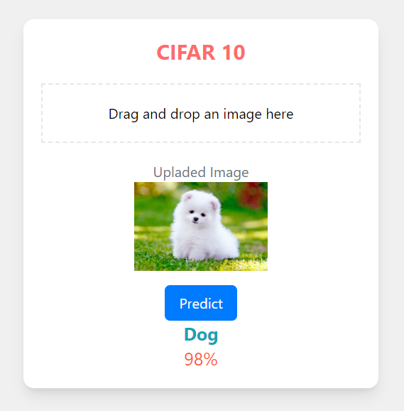

<!-- ABOUT THE PROJECT -->
# Image Classification (CIFAR 10)


This **CIFAR-10 Image Classification App** is a web-based tool for predicting the class of images of the CIFAR-10 dataset.
Users can upload an image, and the app employs a machine learning model to make predictions. The app is built with React for the frontend and FastAPI with Python for the backend. This app is specifically designed for classifying images into various categories within the CIFAR-10 dataset.


Use the `README.md` to get started.

<!-- BUILT WITH -->
# Built With

The Tech Stacks used are:

<div align="center">
  <a href="https://skillicons.dev">
      
  </a>
</div>

## Installation

1. Clone the repository to your local machine:

   ```bash
   git clone https://github.com/Chetan3327/image-classification.git
   ```
2. Navigate to the frontend directory:

   ```bash
   cd frontend
   ```
3. Install dependencies:

   ```bash
   npm install
   ```
4. Navigate to the backend directory:

   ```bash
   cd backend
   ```
5. Install dependencies:

   ```bash
   pip install -r requirements.txt
   ```

<!-- CONTACT -->
# Contact

Name: Chetan Chauhan - chauhanchetan12789@gmail.com

Project Link: https://image-classification-3327.netlify.app/